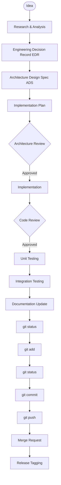

# ARGOS Development Workflow

This document defines the mandatory engineering lifecycle, quality checks, and workflow stages that every feature, subsystem, and architectural change in Project ARGOS must follow.

---

## 1. Purpose

The ARGOS Development Workflow exists to guarantee that quality, security, and design integrity are never compromised. 

A complex, long-term software product cannot survive without disciplined protocols. Ad-hoc development, undocumented assumptions, and rushed releases result in codebases that are difficult to modify and debug. At ARGOS, **consistency, quality, documentation, and systematic review are strictly more important than development speed**. We measure progress by stable, fully-tested subsystems, not raw output.

---

## 2. Development Lifecycle

Every change—from minor feature enhancements to complete subsystems—must progress through the following standardized lifecycle:



### Stage Responsibilities
* **Research:** Gather technical requirements, explore constraints, and compare design alternatives.
* **Engineering Decision Record (EDR):** Formally document the chosen design patterns, system dependencies, and architectural trade-offs.
* **Architecture Design Specification (ADS):** Define modular interfaces, data structures, and folder structures.
* **Implementation Plan:** Plan the sequence of file creation and define the test scenarios before coding.
* **Architecture Review:** Align with system architects and reviewers on the proposed interfaces.
* **Implementation:** Develop the code, focusing on one module at a time.
* **Code Review:** Evaluate the written code against styling, architecture, and security rules.
* **Unit Testing:** Write mock and boundary tests to verify code blocks in isolation.
* **Integration Testing:** Test the component boundaries with actual subsystem dependencies.
* **Documentation Update:** Update system manifests, logs, and changelogs.
* **Git Operations:** Follow strict commit, push, and release tag workflows.

---

## 3. Engineering Decision Records (EDRs)

EDRs are the historical record of why the system is built the way it is.

* **When Required:** An EDR is mandatory for any change introducing new dependencies, changing communication protocols between subsystems, altering memory structures, or changing data flow patterns.
* **Contents:**
  * **Context:** The problem Statement and surrounding technical details.
  * **Options Considered:** Clear descriptions of alternative approaches.
  * **Decision:** The chosen path and the concrete rationale for the choice.
  * **Consequences:** The positive and negative trade-offs of the decision (such as technical debt or latency).
* **Rationale:** Documenting decisions preserves engineering intent, preventing future developers from reverting choices without understanding the historical context.

---

## 4. Architecture Design Specifications (ADS)

An ADS acts as the blueprint for a subsystem. Coding must never begin without an approved ADS.

An ADS must contain:
* **Overview:** A high-level description of what the subsystem does and its purpose.
* **Goals:** Clear statements of what the subsystem will (and will not) accomplish.
* **Public API:** Detailed signatures of all exposed classes, methods, and data models.
* **Folder Structure:** The exact directory and file structure of the subsystem.
* **Responsibilities:** Cohesive descriptions of each internal module's duties.
* **Verification Plan:** The testing strategy, target coverage, and manual testing scenarios.
* **Future Improvements:** Known constraints, performance trade-offs, and technical debt.

---

## 5. Architecture Reviews

Before writing any code, the author must submit the ADS for an Architecture Review.

* **Design Focus:** This review is strictly focused on architecture, boundaries, class models, type safety, and interface contracts, rather than implementation code.
* **Gatekeeping:** Implementation must not begin until the ADS is approved by the architects. This ensures the proposed design fits into the system before development time is invested.

---

## 6. Implementation Guidelines

When the implementation phase begins, follow these rules:

* **One Module at a Time:** Develop linearly. Create a single module, write its basic structure, and get it reviewed before creating subsequent files.
* **Focused Commits:** Keep commits atomic. A single commit should cover one logical module or one change, not multiple distinct tasks.
* **No Multi-Subsystem Splitting:** Never implement or modify multiple subsystems in parallel. Finish, verify, and merge the active subsystem before starting another.

---

## 7. Code Review Philosophy

Code reviews are a collaborative process to ensure implementation quality.

Reviews assess:
* **Correctness:** Does the code solve the problem outlined in the ADS?
* **Readability:** Is the code clean, well-commented, and free of redundant or clever tricks?
* **Maintainability:** Does the module follow the Single Responsibility Principle?
* **Architecture:** Are helper modules private? Are public facades respected?
* **Testing:** Are there mock and happy/sad path tests?
* **Security:** Does the code protect user privacy and handle errors cleanly?

### Review Statuses
* 🟢 **Approved:** Code meets all standards and is ready for integration.
* 🟡 **Approved with Suggestions:** Minor modifications are suggested, but the author may merge without a second review.
* 🔴 **Changes Requested:** Structural or functional issues must be fixed, followed by a re-review.

---

## 8. Testing Requirements

Testing is a core part of the definition of done, not an optional step.

* **Automation:** All tests must be runnable in one command from the project root.
* **Unit Tests First:** Unit tests are required before code can be merged.
* **Integration Tests:** Verifies subsystem interfaces and data contracts.
* **Coverage Standards:**
  * **90%** minimum line coverage across all files.
  * **100%** coverage for core cognitive, parsing, and data validation modules.
* **Build Blockers:** Any failing test blocks the integration and merge process.

---

## 9. Documentation Requirements

A subsystem is not complete until its documentation matches the final implementation.

The developer must update:
* **`CHANGELOG.md`**: Record the version bump and summarize added or modified features.
* **`ENGINEERING_LOG.md`**: Document daily progress, milestones, and design insights.
* **`DECISIONS.md`**: Update EDR manifests and log architectural consequences.

---

## 10. Git Workflow

ARGOS enforces a disciplined Git commit pipeline:

```text
git status  (Verify modified and untracked files before staging)
    │
    ▼
git add     (Stage atomic changes)
    │
    ▼
git status  (Verify that only the intended changes are staged)
    │
    ▼
git commit  (Write clear, descriptive commit messages)
    │
    ▼
git push    (Upload changes)
    │
    ▼
git tag     (Apply semantic version tag for milestones, e.g., v0.1.0)
```

### Checking `git status` Twice
Checking `git status` before and after staging (`git add`) prevents accidental commits of temporary test files, build configurations, or personal notes. This ensures repository hygiene is maintained.

---

## 11. Definition of Done

A subsystem or feature is officially complete only when:
- [ ] The **Architecture Design Specification (ADS)** has been approved.
- [ ] All code conforms to the approved design and style guide.
- [ ] Code review has been completed and marked as **Approved** (🟢).
- [ ] All automated unit and integration tests pass.
- [ ] Subsystem coverage goals (minimum 90%, target 100%) have been met.
- [ ] Documentation (`CHANGELOG.md`, `ENGINEERING_LOG.md`, `DECISIONS.md`) has been updated.
- [ ] Changes are staged and verified via `git status` double-checks.
- [ ] Code is committed with a descriptive message, pushed, and tagged (for milestone releases).

---

## 12. Continuous Improvement

The development workflow is a living process. If a rule or checkpoint introduces friction, the team may propose changes. 

However, changes to this process must be proposed and agreed upon through an Engineering Decision Record (EDR) and merged into this document. Ad-hoc, undocumented process deviations are not permitted.

---

## 13. Final Engineering Philosophy

We build ARGOS by consistently producing small, well-designed, well-tested, and well-documented subsystems. Long-term quality is achieved through disciplined engineering rather than rapid implementation.
