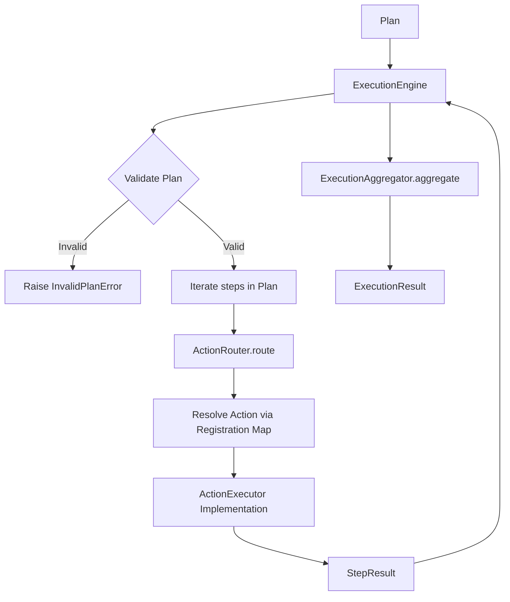

# ADS-004 — Execution Layer

**Document:** Architecture Design Specification (ADS)
**Subsystem:** Execution Layer
**Version:** 0.2
**Status:** Frozen
**Date:** 2 July 2026
**Author:** Arjun Saini

---

## 1. Overview

The **Execution Layer** is the final pipeline subsystem of Project ARGOS. It receives a structured execution recipe (`Plan`) from the Planning layer, orchestrates the sequential execution of its constituent steps (`PlanStep`), and compiles the outcome into a unified `ExecutionResult`.

In accordance with the layered architecture principles of ARGOS, the Execution Layer:
* Is strictly responsible for execution orchestration.
* Must **never** perform planning, intent recognition, confidence evaluation, or response generation.
* Must remain deterministic, stateless in its orchestrator, and independently testable.
* **Version 1 Limitation**: Performs mock execution only. No operating system APIs, shell commands, filesystem operations, browser automation, or network requests are executed.

---

## 2. Goals

* **Deterministic Mock Execution**: Generate predictable simulated step results based on step parameters.
* **Executor Isolation**: Restrict executors to single responsibility boundaries (e.g. file executor does not open apps).
* **Strict API Abstraction**: Hide routing, aggregation, and executor modules behind the main execution facade.
* **High Extensibility**: Structure executors so mock implementations can be replaced by real OS executors in subsequent versions with zero impact on the public API.
* **100% Code Coverage**: Target complete statement coverage in the subsystem test suite.

---

## 3. Public API

Downstream systems (such as the Brain Core orchestrator) interact exclusively with the components exposed at the package root of `argos.execution`:

### Public Classes & Enums
* `ExecutionEngine`: Facade orchestrator accepting a `Plan` and returning an `ExecutionResult`.
* `ExecutionResult`: Dataclass containing execution status, step results, engine ID, and telemetry metadata.
* `ExecutionStatus`: StrEnum containing values: `SUCCESS`, `PARTIAL_SUCCESS`, `FAILED`.
* `StepResult`: Dataclass containing outcome metrics for an individual step, including its action type.

### Public Exceptions
* `ExecutionError`: Base exception for the subsystem.
* `ValidationError`: Base for structure validation failures.
* `InvalidPlanError`: Raised when the input is not a `Plan` object.
* `InvalidStepError`: Raised when a step structure or parameter set is invalid.
* `RoutingError`: Raised when the router fails to find an executor for an action type.
* `ExecutorError`: Raised when an individual executor fails during execution.
* `ProcessingError`: Wraps any unexpected low-level system crashes at the boundary.

No internal engines, base classes, aggregators, or concrete executors shall be exported.

---

## 4. Internal Architecture



### Components

#### 1. ExecutionEngine
The public facade. Coordinates the execution pipeline. It takes a `Plan`, validates it, iterates through its steps sequentially, routes each step to its registered executor, collects `StepResult` objects, and delegates result compilation to `ExecutionAggregator`. Supports dependency injection.

#### 2. ActionRouter
A registry-based router. Maps `Action` enum values to the correct `ActionExecutor` implementation. It supports executor registration via:
```python
def register(self, action: Action, executor: ActionExecutor) -> None:
    pass
```
The router uses an internal `Action` to `ActionExecutor` mapping dictionary rather than conditional branching. Long `if/elif` or `match` chains are explicitly prohibited inside `ExecutionEngine` and `ActionRouter`.

#### 3. ActionExecutor (ABC)
Abstract base class defining the execution interface:
```python
from abc import ABC, abstractmethod

class ActionExecutor(ABC):
    @abstractmethod
    def execute(self, step: PlanStep) -> StepResult:
        pass
```

#### 4. ExecutionAggregator
Stateless component responsible for compiling `StepResult` arrays into the final `ExecutionResult`. It determines the overall `ExecutionStatus` based on the success profile of individual steps:
* All steps succeed -> `ExecutionStatus.SUCCESS`.
* Some steps succeed, others fail -> `ExecutionStatus.PARTIAL_SUCCESS`.
* All steps fail -> `ExecutionStatus.FAILED`.

#### 5. Concrete ActionExecutor Implementations
* **ApplicationExecutor**: Responsible only for `Action.OPEN_APP` and `Action.CLOSE_APP`.
* **FileExecutor**: Responsible only for `Action.CREATE_FILE`, `Action.READ_FILE`, `Action.WRITE_FILE`, and `Action.DELETE_FILE`.
* **WebExecutor**: Responsible only for `Action.SEARCH_WEB`.
* **SystemExecutor**: Responsible only for `Action.RUN_COMMAND`.

---

## 5. Folder Structure

The subsystem will be isolated under `src/argos/execution/`:

```text
src/argos/execution/
│
├── __init__.py              # Exposes only public facade, DTOs, and exceptions
├── constants.py             # Subsystem configuration constants
├── exceptions.py            # Subsystem custom exception tree
│
├── execution_status.py      # ExecutionStatus StrEnum
├── execution_result.py      # ExecutionResult dataclass
├── step_result.py           # StepResult dataclass
│
├── action_executor.py       # ActionExecutor ABC definition
├── action_router.py         # ActionRouter mapping logic
├── execution_aggregator.py  # ExecutionAggregator compilation logic
│
├── application_executor.py  # Application actions implementation
├── file_executor.py         # File actions implementation
├── web_executor.py          # Web actions implementation
├── system_executor.py       # Command actions implementation
│
└── execution_engine.py      # Main ExecutionEngine facade
```

---

## 6. Data Models

Dataclasses must be declared with `slots=True` to restrict dynamic changes and optimize footprint:

### A. ExecutionStatus (StrEnum)
```python
class ExecutionStatus(StrEnum):
    SUCCESS = "success"
    PARTIAL_SUCCESS = "partial_success"
    FAILED = "failed"
```

### B. StepResult
```python
@dataclass(slots=True)
class StepResult:
    step_id: int
    action: Action
    success: bool
    message: str
    metadata: dict[str, Any] = field(default_factory=dict)
```

### C. ExecutionResult
```python
@dataclass(slots=True)
class ExecutionResult:
    status: ExecutionStatus
    step_results: list[StepResult] = field(default_factory=list)
    execution_engine: str = DEFAULT_EXECUTION_ENGINE
    metadata: dict[str, Any] = field(default_factory=dict)
```

*Note: In Version 1, timing, retries, rollback states, stdout/stderr, and live progress indicators are omitted to keep the core execution interfaces simple and pure.*

---

## 7. Deterministic Behaviour

Given the same `Plan` input, the same executor implementations, and identical environment configurations, `ExecutionEngine` must always produce an identical `ExecutionResult` object. No random outcomes or unstable outputs are permitted inside mock executions.

---

## 8. Mock Execution Behavior

Executors return deterministic simulated results. The implementation remains free to decide the exact mock payload for each action type. No real operating system operations (filesystem, terminal, web, application launch) are executed.

---

## 9. Dependency Injection

`ExecutionEngine` supports dependency injection. The router (`ActionRouter`), the compiler (`ExecutionAggregator`), and any future collaborators must be injectable through the `ExecutionEngine` constructor, using sensible default instances if omitted.

---

## 10. Subsystem Constants

```python
# Constants declared in C: C/constants.py
DEFAULT_EXECUTION_ENGINE: Final[str] = "mock_execution_engine"
MAX_PLAN_STEPS: Final[int] = 100
MAX_STEP_MESSAGE_LENGTH: Final[int] = 1024
```

---

## 11. Exception Hierarchy

All custom errors inherit from `ExecutionError`. Unexpected python exceptions are caught at the facade boundary and wrapped in `ProcessingError`:

```text
ExecutionError (Base Exception)
│
├── ValidationError (Validation failures)
│   ├── InvalidPlanError (Plan structure is invalid)
│   └── InvalidStepError (Step parameters are invalid)
│
├── RoutingError (No executor matches the step action type)
│
├── ExecutorError (Simulated execution failure in a module)
│
└── ProcessingError (Unexpected system crashes wrapped at the boundary)
```

---

## 12. Logging Rules

* **INFO Level**: Limited to execution boundary lifecycle events (e.g. `"Execution started for engine: mock_execution_engine"`, `"Execution completed with status: success"`).
* **DEBUG Level**: Detailed step traces (e.g., matching parameters, active routing tables, and specific mock payloads).
* **Privacy boundaries**: No user-sensitive content (such as file paths, command scripts, web queries) is logged at the INFO level.

---

## 13. Verification Plan

The subsystem test suite will target **100% statement coverage** using `pytest` and `pytest-cov`.

* **DTOs**: Verify slot properties (`AttributeError` check) and default factory isolation.
* **Router**: Verify proper registration and routing mapping, raising `RoutingError` on invalid mappings.
* **Executors**: Verify that each concrete executor implementation properly resolves its actions and raises `InvalidStepError` on missing parameters.
* **Aggregator**: Verify compilation of success status based on success/failure combinations.
* **Engine**: Test full pipeline orchestration, dependency injection of custom routers, and `ProcessingError` wrapping when an executor crashes.
* **API Boundary**: Confirm internal modules (executors, router, aggregator) cannot be imported from `argos.execution`.

---

## 14. Future Improvements

### Future Plugin Architecture
By providing the `ActionRouter.register()` method, new executor implementations can be added to the subsystem at runtime without modifying the internal code of `ExecutionEngine` or `ActionRouter`.

This facilitates the plug-and-play introduction of real OS action executors in the future, including:
* **BrowserExecutor**: For `Action.SEARCH_WEB` and automated browser sessions.
* **DatabaseExecutor**: For SQL commands.
* **DockerExecutor**: For container execution.
* **EmailExecutor**: For sending/receiving SMTP alerts.
* **LLMExecutor**: For semantic classification and LLM prompts.
* **CloudExecutor**: For cloud API integrations.
