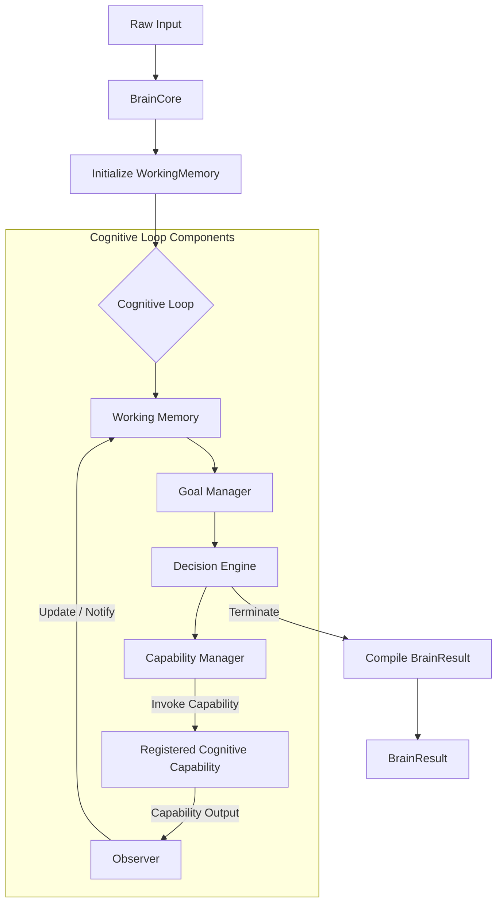

# ADS-005 — Brain Core

**Document:** Architecture Design Specification (ADS)
**Subsystem:** Brain Core Layer (Cognitive Core)
**Version:** 1.2
**Status:** Frozen
**Date:** 2 July 2026
**Author:** Arjun Saini

---

## 1. Overview

The **Brain Core** is the central cognitive hub of the ARGOS Cognitive Operating System. Rather than serving as a linear pipeline orchestrator, the Brain Core functions as an active **Cognitive Loop** that drives continuous reasoning, maintains goal-driven context, and dynamically invokes registered cognitive capabilities.

Under this architecture, the already implemented subsystems—Input Processing (ADS-001), Intent Analysis (ADS-002), Planning (ADS-003), and Execution (ADS-004)—are treated as pluggable **Cognitive Capabilities** rather than components of the Brain itself. The Brain Core coordinates these capabilities, manages goals, and determines cognitive transitions, remaining fully decoupled from capability execution details.

---

## 2. Goals

* **Continuous Reasoning Loop**: Model the core lifecycle around a cyclic reasoning pattern (Perceive $\rightarrow$ Understand $\rightarrow$ Reason $\rightarrow$ Decide $\rightarrow$ Act $\rightarrow$ Observe $\rightarrow$ Reflect $\rightarrow$ Repeat) rather than a sequential pipeline.
* **Loose Coupling (Dependency Injection)**: Accept all capability dependencies via constructor injection at the facade layer, isolating the reasoning loops for mock-based testing.
* **Encapsulation Boundary**: Expose only facade orchestration and outcomes at the package root of `argos.brain`, translating low-level subsystem errors into core exceptions.
* **Deterministic V1 Foundation**: Implement decision-making rules using deterministic heuristics, providing the structural interfaces needed to support neural reasoners in future versions.
* **100% Statement Coverage**: Target complete test coverage across the cognitive core modules.

---

## 3. Responsibilities

* **Goal Coordination**: Evaluate user directives and execution outcomes to determine, refine, track, and update active objectives.
* **Cognitive Decision Making**: Own reasoning over active session parameters to select the next capability, determine clarification thresholds, and govern loop terminations.
* **Capability Management**: Orchestrate, select, and invoke registered cognitive capabilities.
* **Reflection & Evaluation**: Appraise the output of acts and environment responses via structured observation to update internal state and assess goal fulfillment.

---

## 4. Brain Philosophy

The Brain is the cognitive center of ARGOS. It owns intelligence. It owns goals. It owns reasoning. It owns decisions.

Subsystems never decide. Subsystems only provide capabilities. The Brain determines when, why, and how capabilities are used.

The Brain must never become tightly coupled to the implementation details of those subsystems. By treating subsystems as pluggable capabilities, the Brain remains a pure decision engine, insulated from the mechanics of parsing, plan building, or step execution.

---

## 5. Public API

Downstream clients interact exclusively with the components exposed at the package root of `argos.brain`:

### Public Classes & Enums
* `BrainCore`: Facade orchestrator accepting raw input parameters and executing the cognitive loop.
* `BrainResult`: DTO container storing compiled outcomes, decision history, and telemetry.
* `BrainStatus`: StrEnum containing values: `IDLE`, `RUNNING`, `WAITING_FOR_USER`, `COMPLETED`, `FAILED`, `TERMINATED`.

### Public Exceptions
* `BrainError`: Base exception for the Core subsystem.
* `ValidationError`: Base for core structure and validation failures.
* `ProcessingError`: Wraps any unexpected low-level crashes at the boundary.

Internal modules (such as the Goal Manager, Working Memory, Observer, or Decision Engine) are encapsulated and must not be exported.

---

## 6. Cognitive State Model

The Brain Core maintains a sequence of internal cognitive states as it reasons through a session. These represent internal cognitive phases rather than execution state:

```text
  [IDLE]
    │
    ▼
[PERCEIVING] ──► [INTERPRETING] ──► [REASONING]
                                         │
                                         ▼
  [EVALUATING] ◄── [EXECUTING] ◄─── [PLANNING]
        │
        ├─► [WAITING_FOR_USER]
        │
        └─► [COMPLETED] / [FAILED]
```

* **IDLE**: The Brain is inactive, awaiting user input.
* **PERCEIVING**: Accessing input parameters and initializing transient working memory.
* **INTERPRETING**: Invoking Input and Intent capabilities to parse semantic targets.
* **REASONING**: Assessing active objectives, constraints, and deciding next transitions.
* **PLANNING**: Directing the Planning capability to assemble action steps.
* **EXECUTING**: Orchestrating step execution via the Execution capability.
* **EVALUATING**: Appraising outcomes against active goal completion criteria.
* **WAITING_FOR_USER**: Awaiting clarification or confirmation inputs.
* **COMPLETED**: Loop terminated successfully with goals fulfilled.
* **FAILED**: Loop terminated due to error conditions or unrecoverable steps.

---

## 7. Internal Architecture



### Components

#### 1. Goal Manager
Coordinates active goals. The Goal Manager owns goal creation, goal tracking, goal prioritization, goal completion, and goal cancellation. It monitors state transitions and determines when current objectives have succeeded or been aborted.

#### 2. Working Memory
An internal transient cognitive state container owned by the Brain. Working Memory is **not** long-term memory, nor is it a subsystem. It exists only to maintain short-term context (e.g. active goals, parsed parameters, intermediate steps, and decision histories) during loop execution. Future memory implementations will be registered as external capabilities.

#### 3. Decision Engine
The central reasoning component. The Decision Engine owns all decisions. It evaluates Working Memory to determine:
* Current session goal.
* Next capability to invoke.
* Whether clarification is required.
* Whether planning is required.
* Whether execution should occur.
* Whether reasoning should continue.
* When the cognitive loop terminates.

#### 4. Capability Manager
Handles the collection of registered cognitive capabilities injected via constructor parameters. Standard capabilities include:
* **Input Processing**
* **Intent Analysis**
* **Planning**
* **Execution**

#### 5. Observer
A lightweight internal component responsible for tracking outputs of active capabilities.
Responsibilities:
* Receive capability outputs.
* Update Working Memory with result variables.
* Compare expected outcomes against actual results.
* Notify the Decision Engine when outcomes differ from expectations, indicating that re-reasoning is required.

The Observer does not own decision logic; it functions strictly as a reporter and updater of cognitive state.

---

## 8. Folder Structure

The Brain Core subsystem is isolated under `src/argos/brain/`:

```text
src/argos/brain/
│
├── __init__.py           # Exposes only BrainCore, BrainResult, and exceptions
├── constants.py          # Core limit boundaries
├── exceptions.py         # Subsystem custom exception tree
│
├── brain_status.py       # BrainStatus StrEnum
├── brain_result.py       # BrainResult DTO container
├── working_memory.py     # WorkingMemory holding transient cognitive state
├── goal_manager.py       # GoalManager resolving and coordinating objectives
├── decision_engine.py    # DecisionEngine resolving next steps
├── capability_manager.py # CapabilityManager managing registered capabilities
├── observer.py           # Observer component tracking execution outcomes
│
└── brain_core.py         # Public BrainCore facade and cognitive loop execution engine
```

---

## 9. Exception Hierarchy

All custom errors inherit from `BrainError`. Lower-level subsystem exceptions are caught at the capability boundary and wrapped:

```text
BrainError (Base Exception)
│
├── ValidationError (Validation failures)
│
└── ProcessingError (Unexpected system crashes wrapped at the boundary)
```

---

## 10. Data Models

Dataclasses are declared with `slots=True` to enforce immutability bounds:

### BrainResult
```python
@dataclass(slots=True)
class BrainResult:
    parsed_request: ParsedRequest | None
    intent_result: IntentResult | None
    plan: Plan | None
    execution_result: ExecutionResult | None
    decision_history: list[str] = field(default_factory=list)
    final_goal: str = "unknown"
    brain_status: BrainStatus = BrainStatus.IDLE
    brain_engine: str = DEFAULT_BRAIN_ENGINE
    metadata: dict[str, Any] = field(default_factory=dict)
```

---

## 11. Cognitive Loop

The Cognitive Loop executes iteratively:
1. **Perceive**: Collect parameters and initialize Working Memory, transitioning to `PERCEIVING`.
2. **Understand**: Call Input and Intent capabilities to resolve intent results, transitioning to `INTERPRETING`.
3. **Reason**: Invoke the Goal Manager to resolve the session objective, transitioning to `REASONING`.
4. **Decide**: Query the Decision Engine to choose the next cognitive transition.
5. **Act**: Invoke the capability matching the decision (e.g. Planning Capability for `PLANNING`, Execution Capability for `EXECUTING`).
6. **Observe**: The internal `Observer` receives outputs from capability actions, compares expected outcomes against actual results, updates Working Memory variables, and flags the Decision Engine if re-reasoning is required.
7. **Reflect**: Transit to `EVALUATING` to check termination criteria. If complete, transition to `COMPLETED` / `TERMINATED`.
8. **Repeat**: Re-enter loop iteration if the Decision Engine determines that reasoning should continue.

---

## 12. Deterministic Behaviour (Version 1)

Although the Brain is designed to execute a continuous reasoning loop, Version 1 remains purely deterministic:
* **No LLM reasoning**: Transition rules are evaluated using strict heuristics.
* **No autonomous learning**: System parameters are not updated during runtime sessions.
* **No probabilistic decisions**: Branching thresholds use exact confidence matches.
* **No autonomous web exploration**: Web execution steps operate purely in mock parameters.

The core architecture must be structured for future intelligence without implementing it yet.

---

## 13. Logging Philosophy

* **INFO Level**: Transitions in the Cognitive State Model and Goal Manager resolutions (e.g. `"Brain Core transitioned to state: REASONING"`, `"Active Goal resolved: EXECUTE_TASK"`, `"Cognitive loop completed successfully"`).
* **DEBUG Level**: Deep telemetry logs containing parameter details, Working Memory dumps, and decision histories.
* **Privacy boundaries**: No user-sensitive content (such as query strings, command parameters, parsed paths) is logged at the INFO level.

---

## 14. Verification Plan

The subsystem test suite will target **100% statement coverage** using `pytest` and `pytest-cov`.

* **Loop Coordination**: Verify multiple reasoning iterations execute correctly and terminate properly.
* **Limit Safeguards**: Verify that infinite loop protection halts execution if iteration thresholds are exceeded.
* **Dependency Injection**: Inject mock capabilities to isolate loop routing and verify error wrapping.
* **Exception Wrapping**: Confirm that subsystem exceptions are caught at the capability boundary and wrapped in `ProcessingError`.
* **API Boundary**: Confirm internal modules (e.g., `decision_engine`, `working_memory`, `observer`) cannot be imported from `argos.brain`.

---

## 15. Future Evolution

The Brain Core architecture is designed to support the following upgrades without changing the public `BrainCore` API:

### Long-Term Memory
An external Vector Database capability can be registered. During the **Reason** stage, the Decision Engine queries memory stores for historical variables, and during the **Reflect** stage, the engine commits session outcomes to memory.

### Neural Reasoning Loop
The deterministic Decision Engine can be replaced by an LLM reasoner client. By injecting an LLM client into the constructor, loop transitions are driven by prompts, leaving capability interfaces unchanged.

### Self-Evaluation & Reflection
A Reflection Engine capability can be introduced. During the **Reflect** stage, it evaluates the delta between the requested goal and execution outcomes, automatically scheduling secondary correction plans if deviations are identified.

### Goal Decomposition & Multi-Agent Coordination
When the Goal Manager identifies a complex task, the Decision Engine can decompose it into sub-goals and distribute them to registered sub-agents. These sub-agents run independent loops, and their compiled results are merged back into Working Memory. Goal decomposition will become an explicit responsibility of the Goal Manager.

### Future Self Model
An internal cognitive self-model can be introduced to allow ARGOS to understand its own:
* Current capabilities and limitations.
* Active goals and plans.
* Pending clarifications and execution state.
* Overall system health.

This Self Model will support real-time self-monitoring and auto-remediation, integrated into the loop without altering the public `BrainCore` API.
